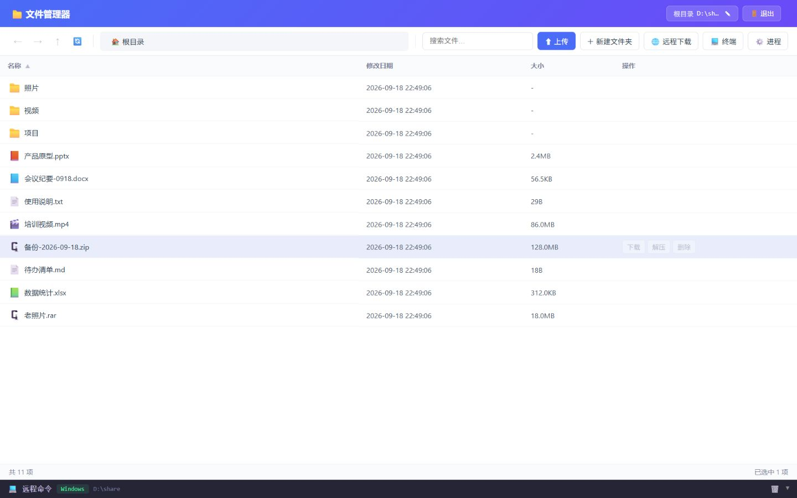
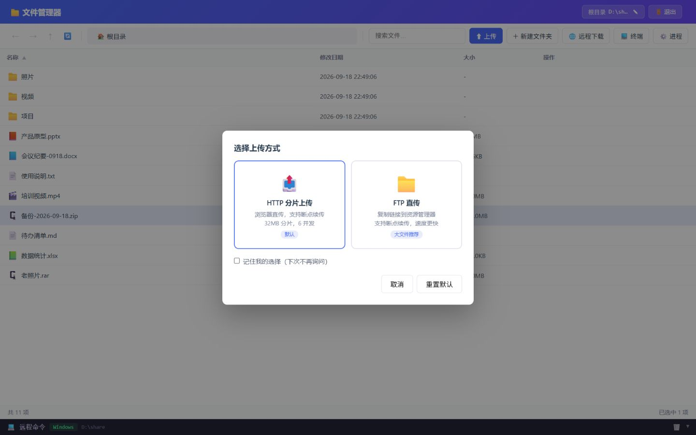
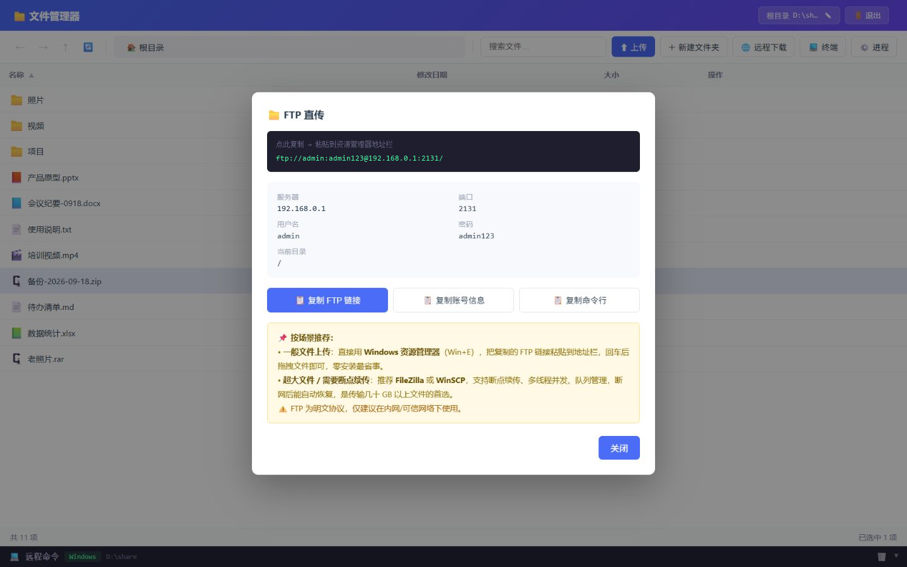
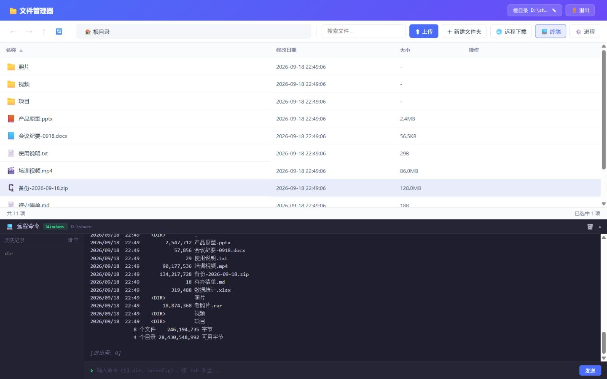
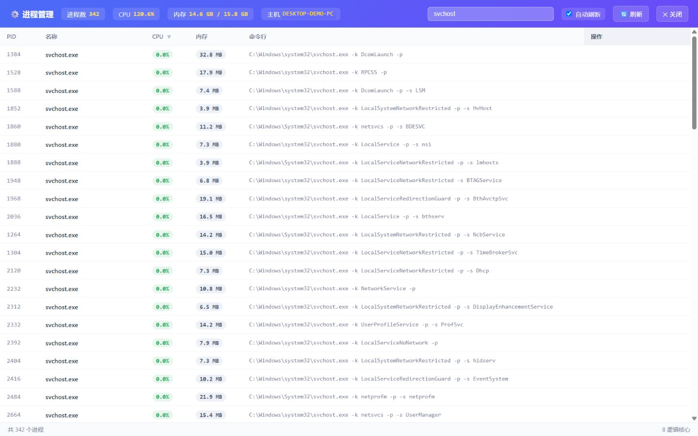

# RemoteFM · Driven by passion

[中文](README.md) | **English**

**One Python file that safely turns any computer into a file manager in your browser.**

## Who it is for

- Turn your home computer into a **private cloud drive** — reach it any time on your LAN or VPN;
- Give **a headless server, Raspberry Pi or NAS** a graphical interface without fighting Samba;
- Manage your computer **from your phone** — transfer photos, watch videos, from bed;
- **Hand a file to a colleague**: send a link or open FTP, zero install on their side.

## Quick start

```bash
pip install flask requests pyftpdlib
python RemoteFM.py
```

Then open <http://127.0.0.1:8880> and log in with `admin / admin123`.

- Skip `pyftpdlib` if you don't need FTP; the app simply disables it.
- With [uv](https://docs.astral.sh/uv/) installed, one line is enough: `uv run RemoteFM.py`.
- To reach it from your phone or another machine, use `http://<your-lan-ip>:8880` and allow it through the firewall on first run.

## You have probably been here

You want a photo from your PC on your phone — the chat app re-compresses it first. You want a document off the old laptop at home — install a cloud client, sign in, sync, wait. Someone needs a 2 GB file from you — they have to install a "transfer tool" before you can even start.

All you wanted was your own file. Somehow it still has to pass through somebody else's server.

**RemoteFM skips all of that: no account, no cloud upload — it just opens a door on your own machine.**



Open a browser and you are looking at that computer's files. Upload, download, preview, zip and unzip — plus FTP, a web terminal and a process viewer. No monitor, no desktop environment? All you need is a browser.

## Why you can relax with it

- **A single file.** Backend, pages and front-end all live in `RemoteFM.py` — no config file, no database, no build step. Read it, fork it, change it.
- **Your data stays yours.** No telemetry, no analytics, nothing collected: files only travel between your own devices.
- **Running in 30 seconds.** Two commands after installing Python, then open `http://127.0.0.1:8880`.
- **Happy on old hardware.** Windows / macOS / Linux, Python 3.8+, at home on a Raspberry Pi, a NAS or a ten-year-old laptop.

## What it does

| | Capability |
| --- | --- |
| 📁 **Files** | Browse, search, sort, multi-select; copy / move / delete / create folders; ZIP compress and extract; switch the root directory anytime |
| ⬆️ **Transfer** | 32MB chunked uploads with resume; in-browser preview for images / video / text; let the server download from a URL for you |
| 🌐 **FTP** | Shares the account and root directory with the web UI — paste the link into Explorer and drag files; steadier for very large files |
| 💻 **Terminal** | Live command output, history, Tab completion, background jobs; the working directory follows the folder you are browsing |
| ⚙️ **Processes** | CPU and memory usage plus full command lines; kill a stuck process in one click |

## One line before you start

The login password equals full control of that machine — **change the default password, keep it on a LAN or VPN, never expose it directly to the internet.** Details in the Security section below.

**MIT licensed** — free to use, modify and redistribute, including commercially.

## Requirements

| Item | Requirement |
| --- | --- |
| Python | **3.8 or newer** (tested on 3.12.10) |
| OS | Windows / macOS / Linux, headless servers included |
| Dependencies | `Flask` and `requests` required; `pyftpdlib` optional (no FTP without it) |
| Browser | Any modern browser — Chrome, Edge, Firefox, Safari, or a phone browser |
| Not needed | No database, no Node.js, no Docker |

Tested with: Windows 11 + Python 3.12.10 + Flask 3.1.3 + Werkzeug 3.1.8 + requests 2.34.2 + pyftpdlib 2.2.0.

## Configuration

Everything is configured through environment variables — no config file, changes take effect immediately.

Windows (PowerShell):

```powershell
$env:SD_ROOT="D:\share"; $env:SD_USER="me"; $env:SD_PASS="a-strong-password"; $env:SD_PORT="8899"; python RemoteFM.py
```

Linux / macOS:

```bash
SD_ROOT=/home/me/share SD_USER=me SD_PASS='a-strong-password' SD_PORT=8899 SD_FTP=0 python RemoteFM.py
```

Local access only (e.g. behind a reverse proxy): `SD_HOST=127.0.0.1 python RemoteFM.py`

| Variable | Default | Description |
| --- | --- | --- |
| `SD_USER` / `SD_PASS` | `admin` / `admin123` | Login used by both the web UI and FTP |
| `SD_ROOT` | `D:\` on Windows, home directory elsewhere | Root directory being managed |
| `SD_HOST` / `SD_PORT` | `0.0.0.0` / `8880` | Bind address and web port |
| `SD_FTP` / `SD_FTP_PORT` | `1` (enabled) / `2121` | FTP toggle and port; passive ports 60000-60049 |
| `SD_FTP_PASSIVE_START` | `60000` | First passive port (50 in a row) |
| `SD_SECRET` | random each start | Session secret; fix it to keep sessions across restarts |

## Security

**The login password equals full control of that machine**: this tool can read, write and
delete files and execute commands.

- Change the default password, run it as a normal user, and point `SD_ROOT` at the directory you actually want to manage;
- Keep it on a LAN or VPN; do not expose it directly to the internet;
- Traffic is plain HTTP by default — put it behind an HTTPS reverse proxy with access control if it must be public.

The app collects nothing, has no telemetry, and only writes chunk files to the system temp
directory. Use it only on machines you own or are authorized to manage. The software is
provided "as is" under the MIT license, without warranty of any kind.

## Features

### File management

Browse, search, sort, multi-select; copy / move / delete / create folders; ZIP compress and extract; switch the root directory anytime.


### Upload and transfer

32MB chunked uploads with resume, in-browser preview for images / video / text, and a URL box that lets the server download the file for you.



### FTP

Shares the account and root directory with the web UI — paste the link into Explorer or FileZilla; made for very large files.



### Web terminal

Run commands with live output, command history, Tab completion and background jobs; the working directory follows the folder you are browsing.



### Processes

See processes, CPU and memory usage and full command lines; search by name, PID or command, and kill a process in one click.



## License

[MIT License](LICENSE) © 2026 willdomybest — free to use, modify and redistribute, including
commercially; just keep the copyright and license notice. This documentation and the images in
`screenshots/` are released under the same license.

### Third-party components

Dependencies are installed with pip; no third-party code is bundled in this repository. All
components remain the property of their authors, and every license is compatible with MIT:

| Component | License |
| --- | --- |
| Flask, Werkzeug, Jinja2, itsdangerous, click, MarkupSafe, idna | BSD-3-Clause |
| blinker, urllib3, charset-normalizer, pyftpdlib | MIT |
| requests | Apache-2.0 |
| certifi | MPL-2.0 |

If you ever distribute a packaged build that includes the dependencies (for example a
PyInstaller executable), ship their license texts with it.

### Contributions

Issues and pull requests are welcome. By submitting a pull request you agree to license your
contribution under the MIT License.
