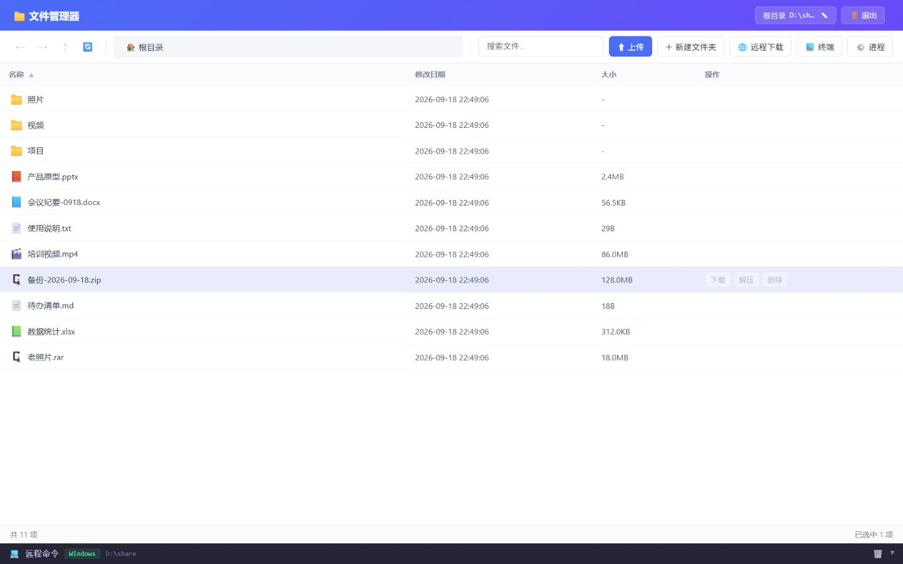
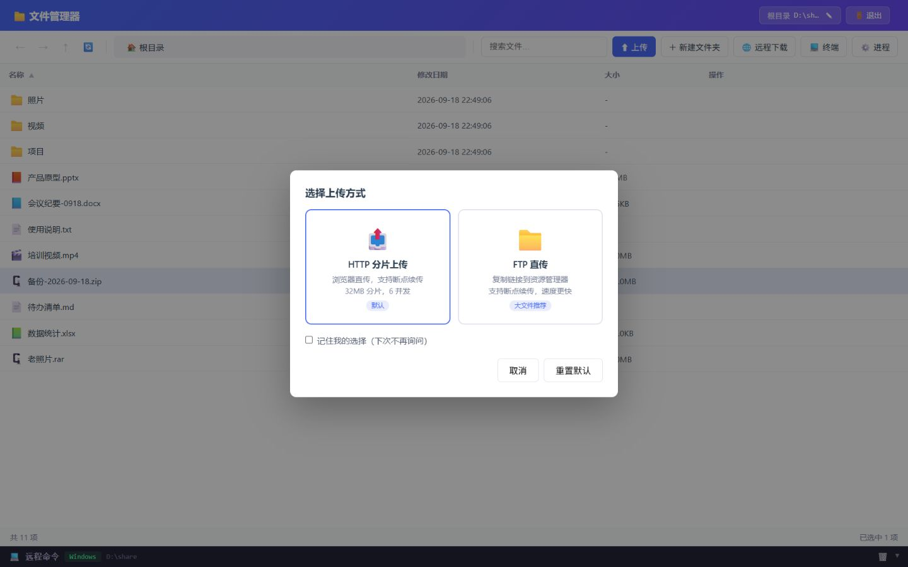
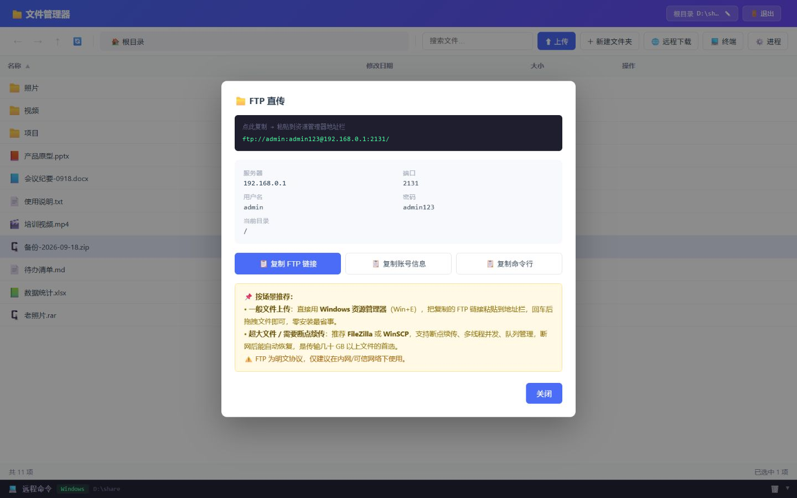
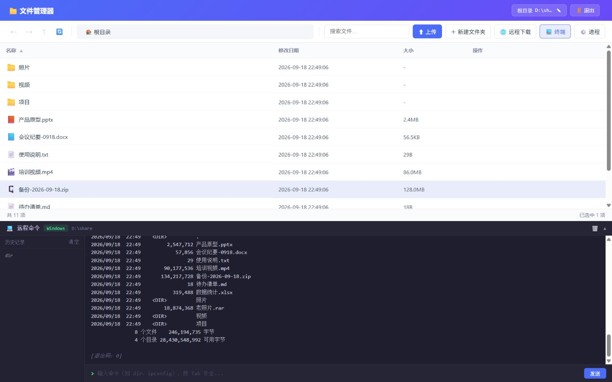
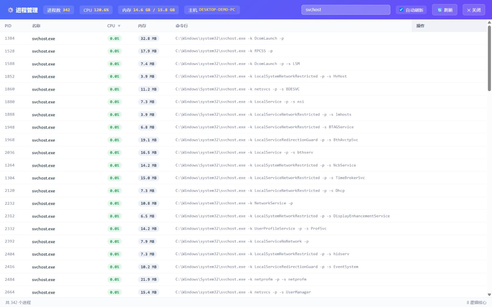

# RemoteFM · Driven by passion

[中文](README.md) | **English**

**One Python file that safely turns any computer into a file manager in your browser.**

## Who it is for

- Turn your home computer into a **private cloud drive** — reach it any time on your LAN or VPN;
- Give **a headless server, Raspberry Pi or NAS** a graphical interface without fighting Samba;
- Manage your computer **from your phone** — transfer photos, watch videos, from bed;
- **Hand a file to a colleague**: send a link or open FTP, zero install on their side.

## Quick start

### Option 1: download the portable build (Windows, no Python needed)

Grab `RemoteFM-v1.4.2-windows-x64.zip` from the [releases page](https://github.com/willdomybest/yueya/releases/latest),
unzip it and double-click `RemoteFM.exe` — **no Python, no dependencies, no installer**, it just runs.

> In China you can also download from [Gitee Releases](https://gitee.com/willdomybest/yueya/releases/latest).
> On macOS / Linux use option 2 below, or build your own with `build_exe.py`.

### Option 2: run from source (Windows / macOS / Linux)

```bash
pip install flask requests pyftpdlib
python RemoteFM.py
```

Either way, open <https://127.0.0.1:8880> and log in with `admin / admin123`. Opening `http://` gets a
307 to HTTPS on the same port; the first run uses a self-signed certificate, so accept the browser's
"Not secure" warning (Advanced → Proceed). HTTPS is on by default and can be turned off in the config.

- Skip `pyftpdlib` if you don't need FTP; the app simply disables it.
- With [uv](https://docs.astral.sh/uv/) installed, one line is enough: `uv run RemoteFM.py`.
- To reach it from your phone or another machine, use `https://<your-lan-ip>:8880` (`http://` redirects
  automatically) and allow it through the firewall on first run.

## You have probably been here

You want a photo from your PC on your phone — the chat app re-compresses it first. You want a document off the old laptop at home — install a cloud client, sign in, sync, wait. Someone needs a 2 GB file from you — they have to install a "transfer tool" before you can even start.

All you wanted was your own file. Somehow it still has to pass through somebody else's server.

**RemoteFM skips all of that: no account, no cloud upload — it just opens a door on your own machine.**



Open a browser and you are looking at that computer's files. Upload, download, preview, zip and unzip — plus FTP, a web terminal and a process viewer. No monitor, no desktop environment? All you need is a browser.

## Why you can relax with it

- **A single file.** Backend, pages and front-end all live in `RemoteFM.py` — aside from the
  `RemoteFM.cfg` generated on first start, there is no database and no build step. Read it, fork it, change it.
- **Your data stays yours.** No telemetry, no analytics, nothing collected: files only travel between your own devices.
- **Running in 30 seconds.** Two commands after installing Python, then open `http://127.0.0.1:8880` (it redirects to HTTPS).
- **Happy on old hardware.** Windows / macOS / Linux, Python 3.8+, at home on a Raspberry Pi, a NAS or a ten-year-old laptop.

## What it does

| | Capability |
| --- | --- |
| 📁 **Files** | Browse, search, sort, multi-select; copy / move / delete / create folders; ZIP compress and extract; switch the root directory anytime |
| ⬆️ **Transfer** | 32MB chunked uploads with resume; in-browser preview for images / video / text; let the server download from a URL for you |
| 🌐 **FTP** | Shares the account and root directory with the web UI — paste the link into Explorer and drag files; steadier for very large files |
| 💻 **Terminal** | Live command output, history, Tab completion, background jobs; the working directory follows the folder you are browsing |
| ⚙️ **Processes** | CPU and memory usage plus full command lines; kill a stuck process in one click |

## One line before you start

The login password equals full control of that machine — **change the default password, keep it on a LAN or VPN, never expose it directly to the internet.** Details in the Security section below.

**MIT licensed** — free to use, modify and redistribute, including commercially.

## Requirements

| Item | Requirement |
| --- | --- |
| Python | **3.8 or newer** (tested on 3.12.10) |
| OS | Windows / macOS / Linux, headless servers included |
| Dependencies | `Flask` and `requests` required; `pyftpdlib` optional (no FTP without it) |
| Browser | Any modern browser — Chrome, Edge, Firefox, Safari, or a phone browser |
| Not needed | No database, no Node.js, no Docker |

Tested with: Windows 11 + Python 3.12.10 + Flask 3.1.3 + Werkzeug 3.1.8 + requests 2.34.2 + pyftpdlib 2.2.0.

## Configuration

### Config file

Every setting lives in a **single** `RemoteFM.cfg` (next to the exe for packaged builds, or wherever `SD_CONFIG`
points). It is generated on first start, and **each entry carries a `comment` explaining it — placed last**:

```json
{
  "comment": "The only RemoteFM config file. Restart to apply; environment variables win when both are set.",
  "version": 1,
  "encryption": {
    "comment": "Encryption for secrets: base64 (default, empty seed ok) / xor (seed required) / hmac-sha256 (seed required, verified)",
    "type": "base64",
    "seed": ""
  },
  "settings": {
    "https":    { "enabled": {"value": true, "comment": "…"}, "cert": {…}, "key": {…} },
    "auth":     { "admin_user": {…}, "admin_pass": {"value": {"__enc": {…}}, "comment": "…"} },
    "ftp":      { "enabled": {…}, "user": {…}, "pass": {…}, "port": {…}, "passive_start": {…} },
    "server":   { "host": {…}, "port": {…}, "secret": {…}, "root": {…} },
    "files":    { "users": {…}, "token": {…}, "key": {…} },
    "terminal": { "history_hours": {"value": 48, "comment": "How long the remote-command API keeps requests"} }
  }
}
```

- **HTTPS (single-port dual protocol, on by default)**: `https.enabled` defaults to `true` (set `false` to opt
  out), and `server.port` alone serves both HTTPS and the plain-HTTP redirect — the first TLS handshake byte
  picks the protocol, so `https://host:8880` works directly while `http://host:8880` gets a 307 to the
  **same port** over HTTPS (a tunnel only needs to map `server.port`). With no certificate paths given, a
  self-signed pair (`remotefm_cert.pem` / `remotefm_key.pem`) is generated on first start — browsers warn
  that it is untrusted. If no usable certificate can be obtained the program **refuses to start** instead of
  silently downgrading to plain HTTP.
- **Secrets are encrypted at rest**: admin password, FTP password and session secret are stored using the
  `encryption` settings above — the file only holds ciphertext plus a MAC, and everything is decrypted on start, so
  logins and the token display keep working after a restart. To produce ciphertext by hand, run
  `python RemoteFM.py --encrypt "new-password"` and paste the result.
- **Environment variables override the file**: `SD_CONFIG`, `SD_HOST`, `SD_PORT`, `SD_ROOT`, `SD_USER`, `SD_PASS`,
  `SD_SECRET`, `SD_FTP`, `SD_USERS`, `SD_TOKEN_FILE`, `SD_KEY_FILE`, `SD_HTTPS`, `SD_HTTPS_CERT`,
  `SD_HTTPS_KEY`.
- `RemoteFM.cfg` is in `.gitignore` — **never commit it** (it holds credentials).

The environment variables below are still supported (they win over the config file):

### Users and permissions

| Role | What it can do |
| --- | --- |
| **Superuser** | `admin / admin123` by default (change it with `SD_USER` / `SD_PASS`). Switch the root directory, use the terminal and process manager, and open user management (add / edit / remove normal users, change any password) |
| **Normal user** | Created by the superuser with a **multi-directory scope** (for example `D:\tt` + `D:\App` + `E:\Lenovo`). Can only browse, upload, download, compress, rename, copy, move and delete **inside those directories**; moving across scopes is rejected. The terminal, process manager and FTP panel stay hidden, the user-management entry is hidden too, and `../` cannot escape the scope |

User management is a full-screen panel close to the process manager: accounts (name / role / scope / actions) on
the left, add & edit forms (rename, password, adjust scope) opening in place on the right.

User data lives in `users.json` next to the program (next to the exe for packaged builds) and passwords are
stored as random-salt SHA-256 hashes. If that directory is not writable it falls back to
`~/.remotefm/users.json`; you can also set `SD_USERS`. Leave the root directory empty when adding a user and
a folder with the same name is created under the superuser's root.

**The root directory itself may be empty too**: empty means "the whole computer" — the list shows every
drive (C:/, D:/ … on Windows) and you can browse anywhere. Setting `SD_ROOT` to an empty string does the
same for the superuser. User management is a full-screen panel like the process manager: accounts and their
roots on the left, add-user / change-password forms in place on the right, with no dialog covering the page.

Windows (PowerShell):

```powershell
$env:SD_ROOT="D:\share"; $env:SD_USER="me"; $env:SD_PASS="a-strong-password"; $env:SD_PORT="8899"; python RemoteFM.py
```

Linux / macOS:

```bash
SD_ROOT=/home/me/share SD_USER=me SD_PASS='a-strong-password' SD_PORT=8899 SD_FTP=0 python RemoteFM.py
```

Local access only (e.g. behind a reverse proxy): `SD_HOST=127.0.0.1 python RemoteFM.py`

| Variable | Default | Description |
| --- | --- | --- |
| `SD_USER` / `SD_PASS` | `admin` / `admin123` | Login used by both the web UI and FTP |
| `SD_ROOT` | `D:\` on Windows, home directory elsewhere | Root directory being managed |
| `SD_HOST` / `SD_PORT` | `0.0.0.0` / `8880` | Bind address and web port |
| `SD_FTP` / `SD_FTP_PORT` | `1` (enabled) / `2121` | FTP toggle and port; passive ports 60000-60049 |
| `SD_FTP_PASSIVE_START` | `60000` | First passive port (50 in a row) |
| `SD_SECRET` | random each start | Session secret; fix it to keep sessions across restarts |

## Packaging a standalone executable

If you don't want to build it yourself, just download the ready-made exe from the
[releases page](https://github.com/willdomybest/yueya/releases/latest).

```bash
python build_exe.py
```

The output lands in `dist/`: the executable plus `LICENSE`, `THIRD_PARTY_NOTICES.txt` and
`licenses/` (full license texts of every dependency). PyInstaller is installed automatically on
the first run, and the icon is generated by the script itself, so no extra asset files are needed.

**Running the app needs only the single `RemoteFM.py` file**; `build_exe.py` is used for packaging
only. When you ship a binary, ship those files with it: BSD / Apache-2.0 / MPL-2.0 all require the
copyright and license notices to travel with the binary.

## Security

**The login password equals full control of that machine**: this tool can read, write and
delete files and execute commands.

- Change the default password, run it as a normal user, and point `SD_ROOT` at the directory you actually want to manage;
- Keep it on a LAN or VPN; do not expose it directly to the internet;
- HTTPS is on by default with a self-signed certificate (browsers warn it is untrusted). For public
  exposure use a trusted certificate and put the service behind an access-controlled reverse proxy.

The app collects nothing, has no telemetry, and only writes chunk files to the system temp
directory. Use it only on machines you own or are authorized to manage. The software is
provided "as is" under the MIT license, without warranty of any kind.

## Features

### File management

Browse, search, sort, multi-select; copy / move / delete / create folders; ZIP compress and extract; switch the root directory anytime.


### Upload and transfer

32MB chunked uploads with resume, in-browser preview for images / video / text, and a URL box that lets the server download the file for you.



### FTP

Shares the account and root directory with the web UI — paste the link into Explorer or FileZilla
(Explorer supports FTP natively; SFTP needs a third-party client); made for very large files.



### Web terminal

Run commands with live output, command history, Tab completion and background jobs; the working directory follows the folder you are browsing.



### Remote command API (token)

The 🔑 button in the terminal header opens it: a **status switch** in the top-right generates the token, and the
token row ends with the switch plus three small icon buttons — 👁 show, 📋 copy, 🔄 refresh (hidden by default).

```bash
# GET (quickest — escape spaces as %20 or +)
curl "http://<your-ip>:8880/api/terminal/exec_token?token=<TOKEN>&cmd=dir"

# POST JSON (recommended — the command stays out of the URL)
curl -X POST "http://<your-ip>:8880/api/terminal/exec_token" \
  -H "X-Token: <TOKEN>" \
  -H "Content-Type: application/json" \
  -d '{"cmd":"dir","cwd":".","timeout":30}'
```

The response is `{"success":true,"exit_code":0,"duration":0.05,"cwd":"...","output":"..."}`; a wrong token or a
disabled API returns 401. The panel keeps the **last 48 hours** of requests (time / source / command / exit code /
duration) and refreshes every 5 seconds.

**Secrets on disk are encrypted**: the token is stored symmetrically (HMAC-SHA256 keystream + encrypt-then-MAC), so
the file only holds `nonce + ciphertext + MAC`. It is decrypted on start, so the token stays visible and keeps
working after a restart. The key comes from `SD_SECRET` when set (recommended — nothing on disk), otherwise a
`key.bin` with mode 600 is generated next to the data. User passwords stay one-way hashed and are never displayed.

### Processes

See processes, CPU and memory usage and full command lines; search by name, PID or command, and kill a process in one click.



## License

[MIT License](LICENSE) © 2026 willdomybest — free to use, modify and redistribute, including
commercially; just keep the copyright and license notice. This documentation and the images in
`screenshots/` are released under the same license.

### Third-party components

Dependencies are installed with pip; no third-party code is bundled in this repository. All
components remain the property of their authors, and every license is compatible with MIT:

| Component | License |
| --- | --- |
| Flask, Werkzeug, Jinja2, itsdangerous, click, MarkupSafe, idna | BSD-3-Clause |
| blinker, urllib3, charset-normalizer, pyftpdlib | MIT |
| requests | Apache-2.0 |
| certifi | MPL-2.0 |

If you ever distribute a packaged build that includes the dependencies (for example a
PyInstaller executable), ship their license texts with it.

### Contributions

Issues and pull requests are welcome. By submitting a pull request you agree to license your
contribution under the MIT License.

## Disclaimer

This project was written out of love. The author hopes it genuinely helps you and keeps it as reliable
as possible, but a few things are worth saying up front:

- The software is provided **"as is"**, without warranty of any kind, express or implied, including
  merchantability, fitness for a particular purpose and non-infringement;
- **Any consequence of using this project's code, in whole or in part, or any program built from it,
  is the user's own to judge and bear** — the author accepts no legal liability;
- It can read, write and delete files and execute commands: please change the default password, keep it
  on a LAN or VPN, and make sure you are authorized to handle the data on that machine;
- Back up anything important first. The author is glad to look into problems you report, but cannot
  promise compensation for data loss, downtime or security incidents.

If that does not match your situation, it is probably best to keep it out of production for now — and
if you would like to talk it through, an issue is always welcome.
